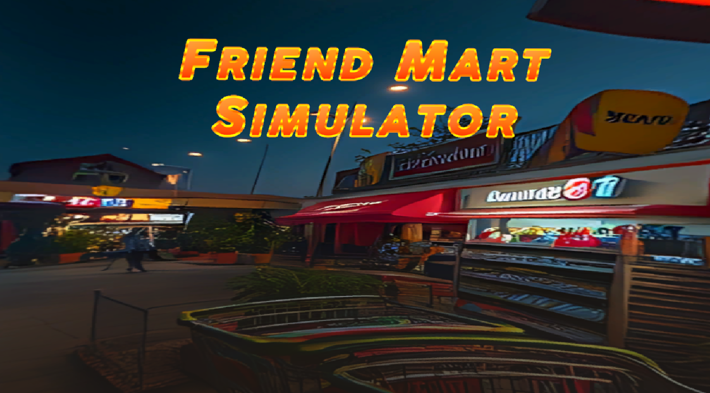
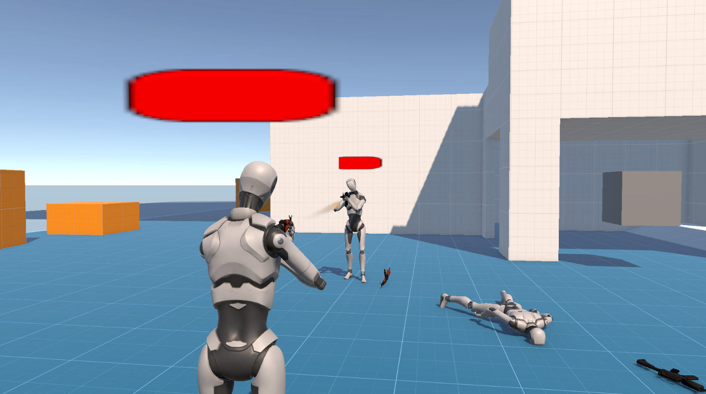

# Goo Yong Kang
**Computer Science – Interactive Software Technology**  

**Email** - [yongkanggoo9@gmail.com](mailto:yongkanggoo9@gmail.com)  
**GitHub** - [https://github.com/YongKang03](https://github.com/YongKang03)  
**LinkedIn** - [https://www.linkedin.com/in/goo-yong-kang-bb92783a0](https://www.linkedin.com/in/goo-yong-kang-bb92783a0)  

## About Me
Hello there! I am Goo Yong Kang, a student who is specializing interactive software technology in computer science field. I am passionate to become game developer and build my career in game industry.

## Skill
- **Programming Language**💻 - C, C#, C++, Python, Java, Kotlin
- **Core Technical Skill**🗡️ - Game development, Object-Oriented Programming (OOP), AI programming
- **Soft Technical Skill**🏹 - UI/UX design principle, VR/AR development, SQL, Web development, Graphics programming, Mobile development
- **Tool**🛠️ - Unity, Microsoft Visual Studio, paint.net, GitHub

## Featured Project

### Friend Mart Simulator 🏪

  
   
  A VR game that simulates a realistic and immersive working environment in a convenience store.
   
  <a href="https://github.com/YongKang03/friend-mart-simulator">View Repository</a>

### Tower Defense Template 🏰

  
   
  An exercise where the modularity, reusabulity and scalability of game systems were explored.
   
  <a href="https://github.com/YongKang03/tower-defense-template">View Repository</a>

### Versus Multiplyer Shooter 🔫

  
   
 A multiplayer third-person shooter prototype built with Unity and FishNet.
   
  <a href="https://github.com/YongKang03/versus-multiplayer-shooter">View Repository</a>

Building more projects... ⚒️
